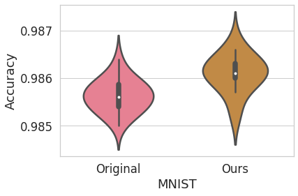

# IDENAS: Internal Dependency-based Exploration for Neural Architecture Search

## Introduction

IDENAS (Internal Dependency-based Exploration for Neural Architecture Search) is an innovative algorithm that seamlessly integrates Neural Architecture Search (NAS) with a novel feature exploration approach. The research addresses the limitations of traditional NAS by autonomously determining optimal input-output configurations, providing an alternative for scenarios where the underlying, associated input-ouput layers are not readily available. 

As machine learning continues to evolve, IDENAS stands out as a powerful tool with the potential to streamline model development and enhance the efficiency of automated machine learning processes. The study provides valuable insights into the methodology, challenges, and potential applications of NAS-based feature selection, establishing IDENAS as a noteworthy advancement in the field.

## Installation

To install IDENAS, follow these steps:

1. Clone the repository.
2. Install the required dependencies by running `pip install -r requirements.txt`.

```bash
keras==2.6.0
segmentation_models==1.0.1
numpy==1.21.2
opencv-python==4.5.3.56
tensorflow==2.6.0 matplotlib==3.4.3
```
## Usage

To use IDENAS, follow these steps:

1. Run main.py
```bash
python main.py
```

In the main.py script, you can customize and experiment with the parameters of InputModel to tailor it for testing different configurations.

## Results

In summary, the research has led to a significant improvement in performance. The figures below showcase the enhancement achieved during the experimentation on the MNIST dataset and the selected features.

1. **MNIST Dataset Results:**
   

   *Caption: Comparison of performance on the MNIST dataset, highlighting the notable improvement achieved through the research.*

2. **Selected Features Impact:**
   

   *Caption: Analysis of the impact of selected features*

These visual representations underscore the effectiveness of the proposed approach in enhancing model performance, emphasizing its potential in real-world applications.
